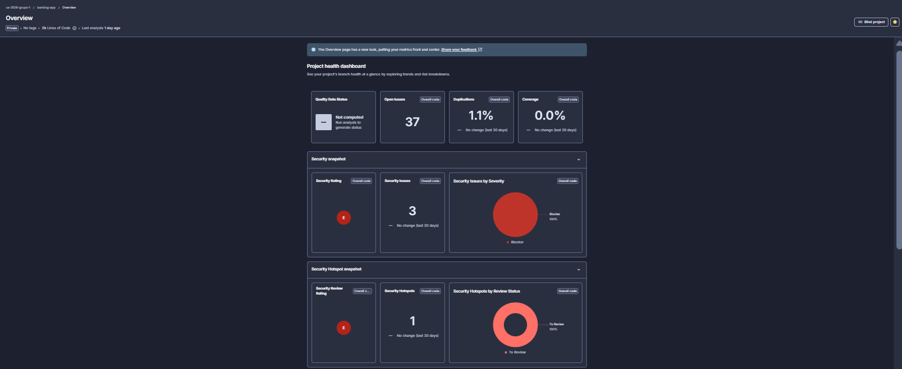
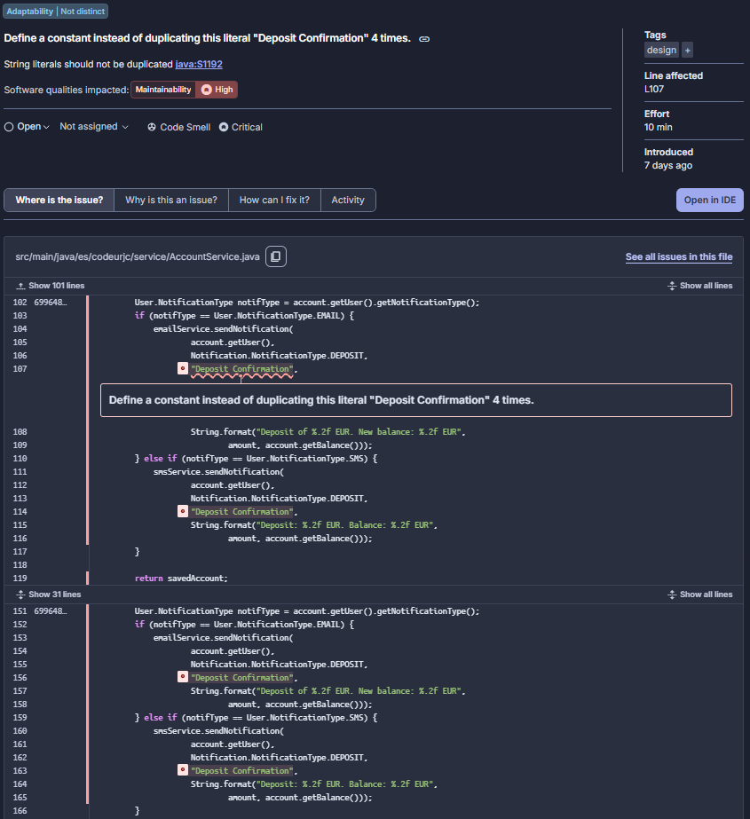
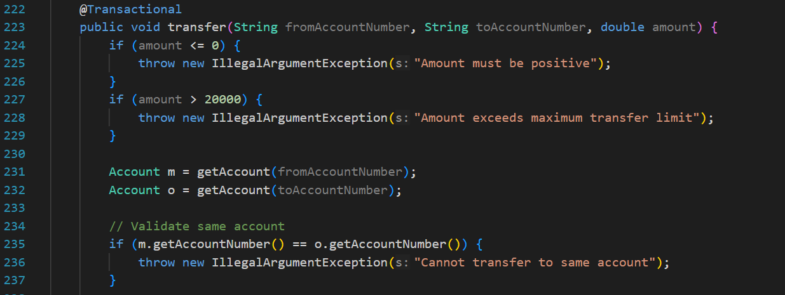
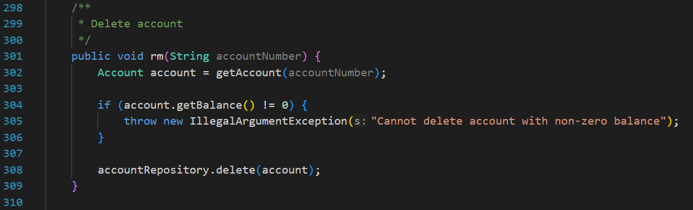
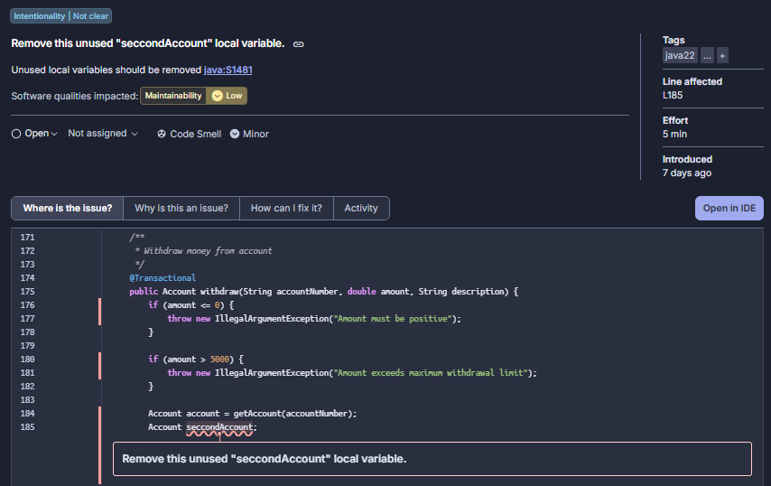
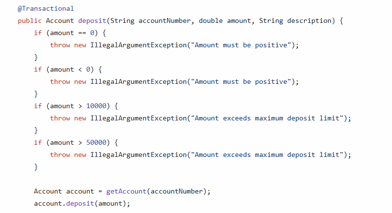
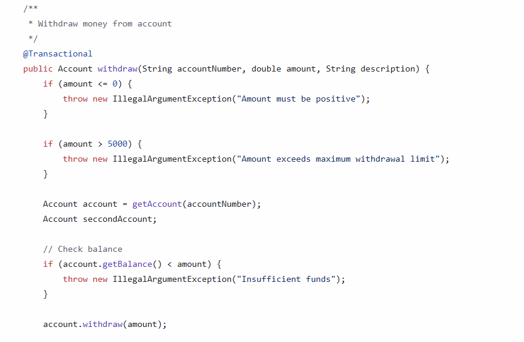
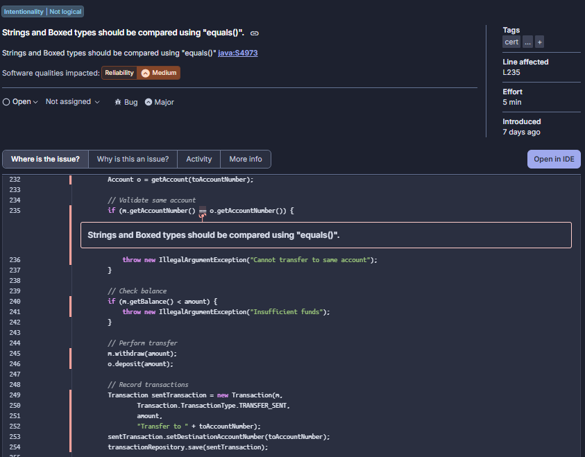
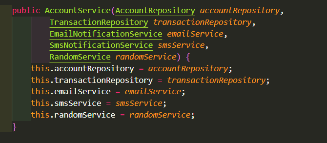
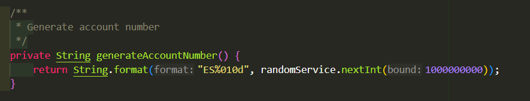

# Práctica 2: Análisis de Calidad del Código (Bad Smells) - Grupo 1

## Integrantes del grupo 1
- Daniel Bonachela Martínez
- Marcelo Atanasio Domínguez Mateo
- Gonzalo Fernández de Córdoba García
- Alejandro García Prada
- Sara Guillén Martínez
- Samuel Melián Benito

## Captura de Pantalla del Overview de SonarQube

## Análisis de Calidad - Issues 

A continuación se muestra un resumen de los issues encontrados en el análisis de calidad realizado con SonarQube y mediante el análisis manual del código:

### Issue 1: Duplicación de Strings (Magic Strings) - Detectado por SonarQube

**Reporte de la issue**:

**Ubicación de la issue**

Clase `AccountService.java`, en múltiples líneas (107, 114, 156, 163)
  
**Explicación de los alumnos del mal olor detectado** 
- El uso de Strings literales repetidos a lo largo del código, lo que usualmente se conoce como *Magic Strings*, hace que el sistema sea algo frágil. En caso de que se necesite modificar este mensaje literal que se repite en múltiples ocasiones (*"Deposit Confirmation"*), habrá que buscar en todo el código ese mensaje y reemplazarlo manualmente. Si olvidamos uno de ellos se pueden crear inconsistencias y comportamientos no esperados.

- Por qué **NO es un falso positivo (Issue real)**: No es un falso positivo puesto que esta repetición de cadenas en 4 ocasiones viola directamente el principio conocido como DRY (*Don't repeat yourself*). Al no tener estos Strings centralizados en variables o constantes, cualquier cambio requerirá modificar la lógica de servicio, lo que aumentará la probabilidad de bugs o inconsistencias como ya hemos comentado anteriormente.

### Issue 2: Nombres de variables y métodos poco descriptivos - Detectado por análisis manual

**Reporte de la issue**:

**Ubicación de la issue**

Clase `AccountService.java`, líneas 231, 232, 301
  
**Explicación de los alumnos del mal olor detectado**
- Hay dos variables de tipo `Account` llamadas `m` y `o`, y en el código no se aporta ningún contexto sobre qué representan (parecen ser cuenta de origen y cuenta de destino, pero lo desconocemos). Obligan a quien lee el código a deducir su propósito leyendo el resto de la función `transfer`. De igual manera, se nombra como `rm` al método para eliminar una cuenta en lugar de darle otro nombre más adecuado como deleteAccount o removeAccount. Estos nombres tan poco descriptivos obligan a estar constantemente "traduciendo" e interpretando el código, lo que dificulta detectar errores lógicos e impacta de forma negativa en la mantenibilidad.

### Issue 3: Variables locales no utilizadas - Detectado por SonarQube

**Reporte de la issue**:

**Ubicación de la issue**

Clase `AccountService.java`, línea 185

**Explicación de los alumnos del mal olor detectado**
- Dentro del método `withdraw` hemos detectado la declaración de una variable llamada `seccondAccount` que no se utiliza a lo largo del código. Además, hay una falta de ortografía en la palabra seccond. No sabemos si es un residuo de una refactorización anterior o si el desarrollador tendría intención de implementar una segunda cuenta la cual al final no llevó a cabo. Esto ensucia el código y dificulta la lectura del método.

- Por qué **NO es un falso positivo (Issue real)**: Creemos que es un issue real porque este tipo de variables hacen que el código sea más difícil de entender. Cuando estás leyendo la función pierdes tiempo buscando dónde se usa esa variable para luego darte cuenta de que no se utiliza. Esto es una mala práctica de limpieza de código, por lo que si una variable no aporta nada al funcionamiento lo mejor es borrarla para que el método sea más sencillo de leer y mantener.

### Issue 4: Uso de tipos primitivos para amount - Detectado por análisis manual

**Reporte de la issue**:

**Ubicación de la issue**

Clase `AccountService.java`, líneas 77, 126, 175, 223, 314
  
**Explicación de los alumnos del mal olor detectado**
- Nos hemos dado cuenta de que para gestionar los saldos y las cantidades de las transferencias se está usando el tipo `double`. El problema es que los `double` no son exactos para temas de dinero porque funcionan con un sistema de coma flotante binaria, es decir, cuando se realizan operaciones matemáticas pueden aparecer decimales infinitos o errores de precisión muy raros. Por ejemplo, te puede pasar que una cuenta que debería tener $0.30$ acabe teniendo $0.30000000000000004$ por un error de redondeo, por lo que puede llegar a ser un problema bastante crítico. Es un problema real y bastante grave porque pone en peligro la fiabilidad de los datos financieros. Si usásemos BigDecimal o una clase propia llamada Money podríamos controlar exactamente cuántos decimales queremos y cómo queremos que se haga el redondeo. Al tenerlo como un double habría que gestionar los redondeos y el formato en cada método donde se haga el cálculo. Esto implica que la responsabilidad de cómo tratar el dinero acabe dispersa por todo el `AccountService` en lugar de estar en un solo sitio centralizado . Si esto se quedase así a la larga habrá desajustes en las cuentas de los clientes y será casi imposible encontrar dónde empezó el error.

### Issue 5: Comparación de strings sin utilizar equals() - Detectado por SonarQube

**Reporte de la issue**:

**Ubicación de la issue**

Clase `AccountService.java`, en la línea 235
  
**Explicación de los alumnos del mal olor detectado** 
- La comparación de Strings utilizando el operador == en lugar del método equals() puede provocar errores lógicos. En Java, el operador == compara referencias en memoria, no el contenido del objeto. Por lo tanto, aunque dos cadenas tengan el mismo texto, la comparación puede devolver false si no apuntan al mismo objeto.

- Esto puede generar comportamientos inesperados en la aplicación, especialmente en condiciones (if) donde se espera comparar valores. El uso incorrecto de == en lugar de equals() rompe la correcta comparación de contenido y puede afectar a la lógica del negocio.

- Por qué **NO es un falso positivo (Issue real)**: No es un falso positivo porque el uso de == para comparar Strings es una práctica incorrecta en Java cuando se desea comparar su contenido. SonarQube detecta correctamente este patrón como un posible bug o code smell, ya que puede derivar en fallos funcionales difíciles de detectar. La solución adecuada es utilizar equals().

### Issue 7: Large Class - Detectado por análisis manual

**Reporte de la issue**:

**Ubicación de la issue**

Clase `AccountService.java` (al completo)

**Explicación de los alumnos del mal olor detectado**
- Una *Large Class* es una clase que aglutina numerosas responsabilidades sin las que el programa funcionaría. En nuestro caso, `AccountService` cuenta con la gestión de las cuentas, las validaciones y las operaciones del negocio, lo cual entra perfectamente en la definición.

- Se evidencia en el constructor, debido a la gran cantidad de funcionalidades es muy grande y hereda multitud de objetos.

- Esta acumulación de responsabilidades induce una violación del **Principio de Responsabilidad Única (SRP)**, ya que por razones ya apuntadas son muchas las funciones de la clase. Esto a la larga acabará dificultando el mantenimiento y aumentando el riesgo de errores. Además, aumenta sensiblemente el acoplamiento del código, lo cual, es algo a evitar en cualquier programa orientado a objetos.

### Issue 8: Comentarios poco útiles o mal estructurados - Detectado por análisis manual

**Reporte de la issue**:

**Ubicación de la issue**

Clase `AccountService.java`, en la cabecera métodos

**Explicación de los alumnos del mal olor detectado**
- A lo largo del código se puede ver que alguien se esforzó por dejar constancia de que hacía el código, pero este no sigue ningún estándar. Además, algunos ni siquiera aportan información, simplemente describen superficialmente aquello que ya se puede inferir leyendo superficialmente el código.
- Los comentarios superficiales no aportan valor al código y pueden inducir a error. Si el código cambia y los comentarios no se actualizan, la información que contienen deja de ser fiable. Esto afecta a la mantenibilidad y dificulta que otros desarrolladores comprendan el código.