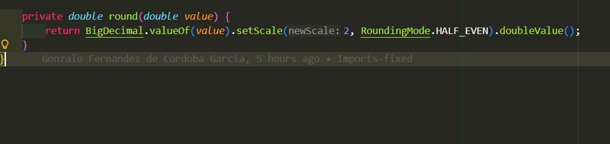
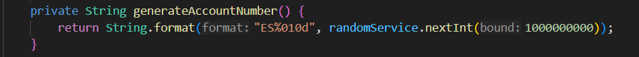
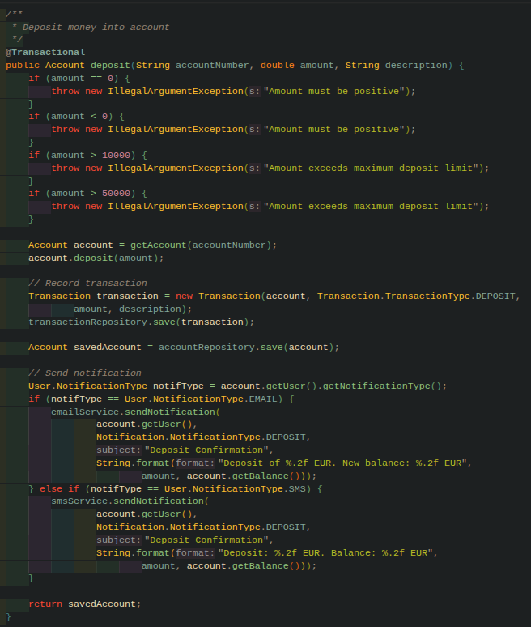
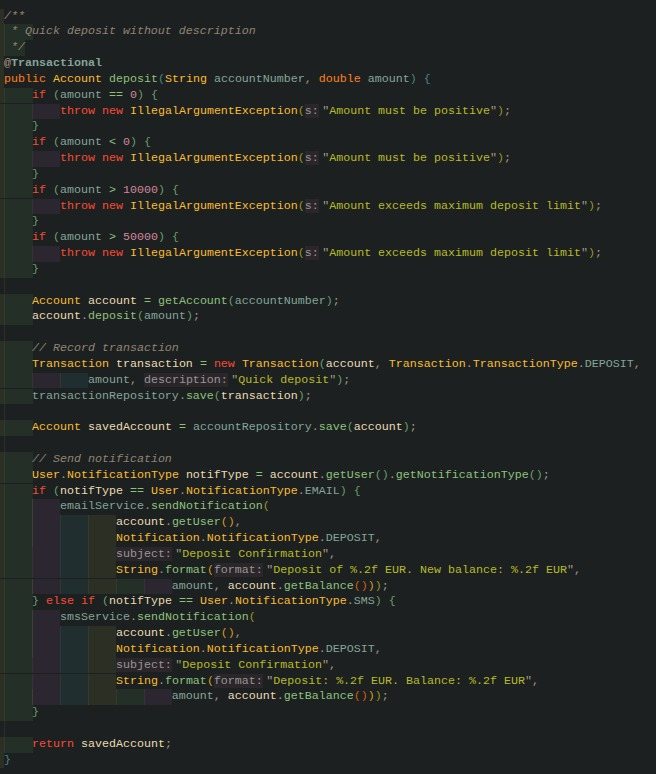
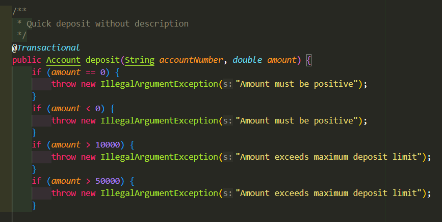
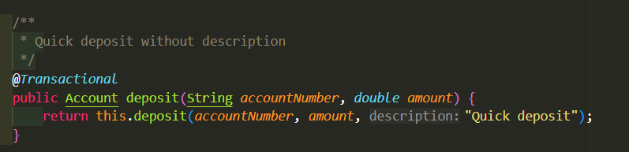

# Práctica 2: Análisis de Calidad del Código (Bad Smells) - Grupo 1

## Integrantes del grupo 1
- Daniel Bonachela Martínez
- Marcelo Atanasio Domínguez Mateo
- Gonzalo Fernández de Córdoba García
- Alejandro García Prada
- Sara Guillén Martínez
- Samuel Melián Benito

## Captura de Pantalla del Overview de SonarQube


## Análisis de Calidad - Issues 

A continuación se muestra un resumen de los issues encontrados en el análisis de calidad realizado con SonarQube y mediante el análisis manual del código:

### Issue 1: Duplicación de Strings (Magic Strings) - Detectado por SonarQube

**Reporte de la issue**:


**Ubicación de la issue**

Clase `AccountService.java`, en múltiples líneas (107, 114, 156, 163)
  
**Explicación de los alumnos del mal olor detectado** 
- El uso de Strings literales repetidos a lo largo del código, lo que usualmente se conoce como *Magic Strings*, hace que el sistema sea algo frágil. En caso de que se necesite modificar este mensaje literal que se repite en múltiples ocasiones (*"Deposit Confirmation"*), habrá que buscar en todo el código ese mensaje y reemplazarlo manualmente. Si olvidamos uno de ellos se pueden crear inconsistencias y comportamientos no esperados.

- Por qué **NO es un falso positivo (Issue real)**: No es un falso positivo puesto que esta repetición de cadenas en 4 ocasiones viola directamente el principio conocido como DRY (*Don't repeat yourself*). Al no tener estos Strings centralizados en variables o constantes, cualquier cambio requerirá modificar la lógica de servicio, lo que aumentará la probabilidad de bugs o inconsistencias como ya hemos comentado anteriormente.

**Refactorización**
Los Strings literales repetidos como por ejemplo "Deposit Confirmation" o "Transfer received" han sido extraídos a constantes `private static final String` declaradas al inicio de la clase. Así, cualquier cambio en el texto solo requerirá modificar el texto en un único lugar, eliminando el riesgo de inconsistencias.

### Issue 2: Nombres de variables y métodos poco descriptivos - Detectado por análisis manual

**Reporte de la issue**:


**Ubicación de la issue**

Clase `AccountService.java`, líneas 231, 232, 301
  
**Explicación de los alumnos del mal olor detectado**
- Hay dos variables de tipo `Account` llamadas `m` y `o`, y en el código no se aporta ningún contexto sobre qué representan (parecen ser cuenta de origen y cuenta de destino, pero lo desconocemos). Obligan a quien lee el código a deducir su propósito leyendo el resto de la función `transfer`. De igual manera, se nombra como `rm` al método para eliminar una cuenta en lugar de darle otro nombre más adecuado como deleteAccount o removeAccount. Estos nombres tan poco descriptivos obligan a estar constantemente "traduciendo" e interpretando el código, lo que dificulta detectar errores lógicos e impacta de forma negativa en la mantenibilidad.

**Refactorización**
Las variables `m` y `o` del método `transfer` han sido renombradas a `sourceAccount` y `destination`, reflejando claramente su propósito dentro del método y dejando claro su significado. Además, el método `rm` ha sido renombrado a `removeAccount`, haciendo que su intención quede clara sin que haga falta leer la implementación. Esto hace mucho más legible y mantenible el código.

### Issue 3: Variables locales no utilizadas - Detectado por SonarQube

**Reporte de la issue**:


**Ubicación de la issue**

Clase `AccountService.java`, línea 185

**Explicación de los alumnos del mal olor detectado**
- Dentro del método `withdraw` hemos detectado la declaración de una variable llamada `seccondAccount` que no se utiliza a lo largo del código. Además, hay una falta de ortografía en la palabra seccond. No sabemos si es un residuo de una refactorización anterior o si el desarrollador tendría intención de implementar una segunda cuenta la cual al final no llevó a cabo. Esto ensucia el código y dificulta la lectura del método.

- Por qué **NO es un falso positivo (Issue real)**: Creemos que es un issue real porque este tipo de variables hacen que el código sea más difícil de entender. Cuando estás leyendo la función pierdes tiempo buscando dónde se usa esa variable para luego darte cuenta de que no se utiliza. Esto es una mala práctica de limpieza de código, por lo que si una variable no aporta nada al funcionamiento lo mejor es borrarla para que el método sea más sencillo de leer y mantener.

**Refactorización**
Se utilizará una captura de pantalla del código o código resaltado para mostrar la solución. Se acompañará dicha solución de un breve comentario explicándola.

### Issue 4: Uso de tipos primitivos para amount - Detectado por análisis manual

**Reporte de la issue**:


**Ubicación de la issue**

Clase `AccountService.java`, líneas 77, 126, 175, 223, 314
  
**Explicación de los alumnos del mal olor detectado**
- Nos hemos dado cuenta de que para gestionar los saldos y las cantidades de las transferencias se está usando el tipo `double`. El problema es que los `double` no son exactos para temas de dinero porque funcionan con un sistema de coma flotante binaria, es decir, cuando se realizan operaciones matemáticas pueden aparecer decimales infinitos o errores de precisión muy raros. Por ejemplo, te puede pasar que una cuenta que debería tener $0.30$ acabe teniendo $0.30000000000000004$ por un error de redondeo, por lo que puede llegar a ser un problema bastante crítico.

- Es un problema real y bastante grave porque pone en peligro la fiabilidad de los datos financieros. Si usásemos BigDecimal o una clase propia llamada Money podríamos controlar exactamente cuántos decimales queremos y cómo queremos que se haga el redondeo. Al tenerlo como un double habría que gestionar los redondeos y el formato en cada método donde se haga el cálculo. Esto implica que la responsabilidad de cómo tratar el dinero acabe dispersa por todo el `AccountService` en lugar de estar en un solo sitio centralizado. Si esto se quedase así a la larga habrá desajustes en las cuentas de los clientes y será casi imposible encontrar dónde empezó el error.

**Refactorización**
Para solucionar el problema de precisión sin alterar el contrato de las entidades existentes, se ha centralizado la gestión del dinero en el `AccountService` mediante dos mecanismos:

1.  **Método de redondeo centralizado**: Se ha implementado el método privado `round(double value)`, que utiliza `BigDecimal` con una escala de 2 decimales y el modo de redondeo bancario `RoundingMode.HALF_EVEN`.
2.  **Saneamiento de estado (Input/Output)**: El servicio ahora redondea la cantidad de entrada antes de procesarla y, de forma crucial, realiza un saneamiento del saldo de la cuenta inmediatamente después de cualquier operación aritmética (`setBalance(round(account.getBalance()))`). Esto garantiza que cualquier residuo de precisión generado por el tipo `double` en la entidad sea corregido antes de persistir los datos.



```java
// Ejemplo de aplicación en el método transfer
public void transfer(String fromAccountNumber, String toAccountNumber, double amount) {
    double roundedAmount = round(amount); // Saneamiento de entrada
    
    Account sourceAccount = getAccount(fromAccountNumber);
    Account destinationAccount = getAccount(toAccountNumber);

    // Validaciones y lógica de negocio
    validationService.checkSufficientFunds(roundedAmount, sourceAccount.getBalance());

    // Operación y saneamiento correctivo del estado de las entidades
    sourceAccount.withdraw(roundedAmount);
    sourceAccount.setBalance(round(sourceAccount.getBalance()));

    destinationAccount.deposit(roundedAmount);
    destinationAccount.setBalance(round(destinationAccount.getBalance()));

    // Persistencia de transacciones y cuentas
    accountRepository.save(sourceAccount);
    accountRepository.save(destinationAccount);
}

/**
 * Garantiza la precisión decimal necesaria para operaciones financieras
 */
private double round(double value) {
    return BigDecimal.valueOf(value).setScale(2, RoundingMode.HALF_EVEN).doubleValue();
}
```

### Issue 5: Comparación de strings sin utilizar equals() - Detectado por SonarQube

**Reporte de la issue**:


**Ubicación de la issue**

Clase `AccountService.java`, en la línea 235
  
**Explicación de los alumnos del mal olor detectado** 
- La comparación de Strings utilizando el operador == en lugar del método equals() puede provocar errores lógicos. En Java, el operador == compara referencias en memoria, no el contenido del objeto. Por lo tanto, aunque dos cadenas tengan el mismo texto, la comparación puede devolver false si no apuntan al mismo objeto.

- Esto puede generar comportamientos inesperados en la aplicación, especialmente en condiciones (if) donde se espera comparar valores. El uso incorrecto de == en lugar de equals() rompe la correcta comparación de contenido y puede afectar a la lógica del negocio.

- Por qué **NO es un falso positivo (Issue real)**: No es un falso positivo porque el uso de == para comparar Strings es una práctica incorrecta en Java cuando se desea comparar su contenido. SonarQube detecta correctamente este patrón como un posible bug o code smell, ya que puede derivar en fallos funcionales difíciles de detectar. La solución adecuada es utilizar equals().

**Refactorización**
Se utilizará una captura de pantalla del código o código resaltado para mostrar la solución. Se acompañará dicha solución de un breve comentario explicándola.

### Issue 6: Colisiones en la generación de Número de Cuenta - Detectado por análisis manual

**Reporte de la issue**




**Ubicación de la issue**

Clase `AccountService.java`, en la línea 55

**Explicación de los alumnos del mal olor detectado**

- El principal problema de este método es que no se garantiza la unicidad de los números de cuenta generados. Al basarse en un generador de números aleatorios dentro de un rango limitado, existe la posibilidad de que se produzcan colisiones, es decir, que se generen dos cuentas con el mismo identificador.

**Refactorización**
Se utilizará una captura de pantalla del código o código resaltado para mostrar la solución. Se acompañará dicha solución de un breve comentario explicándola.

### Issue 7: Large Class - Detectado por análisis manual

**Reporte de la issue**:


**Ubicación de la issue**

Clase `AccountService.java` (al completo)

**Explicación de los alumnos del mal olor detectado**
- Una *Large Class* es una clase que aglutina numerosas responsabilidades sin las que el programa funcionaría. En nuestro caso, `AccountService` cuenta con la gestión de las cuentas, las validaciones y las operaciones del negocio, lo cual entra perfectamente en la definición.

- Se evidencia en el constructor, debido a que la cantidad de funcionalidades es muy grande y se inyectan multitud de objetos.

- Esta acumulación de responsabilidades induce una violación del **Principio de Responsabilidad Única (SRP)**, ya que por razones ya apuntadas son muchas las funciones de la clase. Esto a la larga acabará dificultando el mantenimiento y aumentando el riesgo de errores. Además, aumenta sensiblemente el acoplamiento del código, lo cual, es algo a evitar en cualquier programa orientado a objetos.

**Refactorización**
Se han creado dos nuevas clases para modularizar la funcionalidad de `AccountService`: `AccountNotificationService` y `AccountValidationService`. De esta manera, toda la lógica correspondiente a enviar y recibir notificaciones, así como la de validación de diversos datos, se extrae de la lógica principal. Con esto, no solo hemos conseguido reducir el tamaño de la clase `AccountService` en ~100 líneas, sino que la hemos liberado de dos responsabilidades, siendo actualmetne responsable únicamente de orquestrar la lógica general, y no de cuestiones menores.


### Issue 8: Comentarios poco útiles o mal estructurados - Detectado por análisis manual

**Reporte de la issue**:


**Ubicación de la issue**

Clase `AccountService.java`, en la cabecera métodos

**Explicación de los alumnos del mal olor detectado**
- A lo largo del código se puede ver que alguien se esforzó por dejar constancia de que hacía el código, pero este no sigue ningún estándar. Además, algunos ni siquiera aportan información, simplemente describen superficialmente aquello que ya se puede inferir leyendo superficialmente el código.
- Los comentarios superficiales no aportan valor al código y pueden inducir a error. Si el código cambia y los comentarios no se actualizan, la información que contienen deja de ser fiable. Esto afecta a la mantenibilidad y dificulta que otros desarrolladores comprendan el código.

**Refactorización**
Se han eliminado los comentarios que simplemente repetían el nombre del método y se reemplazaron por comentarios que explican el porqué y el contexto no evidente del código. Todos siguen ahora el mismo estilo, evitando que queden desactualizados y aportando información real a quien lee el código.

### Issue 9: Métodos excesivamente largos - Detectado por análisis manual

**Reporte de la issue**:


**Ubicación de la issue**

Clase `AccountService.java`, métodos `deposit` (línea 77), `deposit` (línea 126), `withdraw` (línea 175) y `transfer` (línea 223)
  
**Explicación de los alumnos del mal olor detectado**
- Como fue mencionado anteriormente en el *Issue 7*, el código aglutina demasiadas responsabilidades. Esto tiene como consecuencia directa la presencia de métodos excesivamente largos (**Long Methods**) con un bajo grado de cohesión, que presentan código que debería ser extraído a otros métodos auxiliares. 

- En los 4 métodos (especialmente en `transfer`), encontramos secciones de código con propósitos diferenciados: comprobación de la cantidad introducida, validación del número de cuenta, comprobación del balance, realización de la operación, registro de la operación o envío de notificaciones. Esto empeora considerablemente la legibilidad del código y deriva en la presencia de comentarios que delimiten y agreguen contexto a las distintas secciones del método.

**Refactorización**
Se han extraído métodos privados para separar las responsabilidades que antes estaban mezcladas en un solo método largo. `recordTransaction` ahora centraliza la creación y guardado de transacciones, evitando repetir el mismo bloque en deposit, withdraw y transfer. Para la transferencia, se han añadido dos métodos `withdrawForTransferAndSave` y `depositFromTransferAndSave`, que se encargan la operación sobre el balance de la cuenta junto con su guardado. Las validaciones y notificaciones ya han sido delegadas en las dos clases creadas : `AccountValidationService` y `AccountNotificationService` Con esto, los tres métodos públicos quedan reducidos a cinco llamadas claras: validar, operar, registrar, persistir y notificar.


### Issue 10: Comprobación de tipo mediante ifs-else -  Detectado por análisis manual

**Reporte de la issue**:


**Ubicación de la issue**

Clase `AccountService.java`, métodos `deposit` (línea 102), `deposit` (línea 151), `withdraw` (línea 201) y `transfer` (línea 266)
  
**Explicación de los alumnos del mal olor detectado**

- En los 4 métodos se comprueba el tipo de notificación mediante bloques `if-else` encadenados. Esto se corresponde al bad smell de **Switch Statements**, ya que imposibilita la adición de tipos adicionales sin modificar el código existente (viola el **Open/Closed principle**). Esto resulta en un mayor acoplamiento del código, entorpeciendo tanto su mantenibilidad como su extensibilidad.

**Refactorización**
Se utilizará una captura de pantalla del código o código resaltado para mostrar la solución. Se acompañará dicha solución de un breve comentario explicándola.


### Issue 11: Código duplicado en el método `deposit` - Detectado por análisis manual

**Reporte de la issue**:
Observamos que hay dos implementaciones idénticas del método `deposit`, que solo difieren en el argumento `String description`.

La primera de ellas, toma tres argumentos, `String accountNumber`, `double amount`, `String description`.



La segunda, toma los mismos argumentos a excepción de `String description`.



**Ubicación de la issue**
Clase `AccountService.java`, método `deposit`.

**Explicación de los alumnos del mal olor detectado**
- El código de ambas funciones es prácticamente idéntico, salvo en la línea en la que se crea el objeto de tipo `Transaction`:
```java
    // public Account deposit(String accountNumber, double amount, String description)
    Transaction transaction = new Transaction(account, Transaction.TransactionType.DEPOSIT,
            amount, description);
            
    // public Account deposit(String accountNumber, double amount)
    Transaction transaction = new Transaction(account, Transaction.TransactionType.DEPOSIT,
            amount, "Quick deposit");
```

- Esta diferencia no justifica la duplicación de más de 40 líneas, por lo que consideraremos esta práctica un *bad smell*. Esto afecta de manera considerable a la mantenibilidad y escalabilidad del código, ya que cualquier cambio que queramos hacer en `deposit`, supondrá un cambio en ambos lugares. 

**Refactorización**
Se ha mantenido la interfaz externa de la clase, empleando el método que tomaba el argumento `description` para implementar el método `deposit` con un valor de `description` por defecto. De esta manera, la lógica solo está presente una vez en el código y es reutilizada, evitando el código duplicado.


### Issue 12: Código inalcanzable (Dead Code) - Detectado por análisis manual

**Reporte de la issue**:


**Ubicación de la issue**

Clase `AccountService.java`, método `deposit(String accountNumber, double amount)`

**Explicación de los alumnos del mal olor detectado**
- En el método `deposit`, se ve a simple vista una validación redundante donde se comprueba si `amount > 50000` después de haber validado previamente que `amount > 10000`. Trivialmente, cualquier valor mayor que 50000 ya es mayor que 10000, este bloque de código nunca llegará a ejecutarse.

- Este tipo de código inalcanzable (*dead code*) introduce código innecesario y puede generar confusión en el mantenimiento, ya que sugiere la existencia de una lógica oculta adicional que en realidad nunca se aplica.

**Refactorización**
Se ha eliminado el bloque de código redundante. Además, siguiendo principios de responsabilidad única, la lógica de validación se ha delegado en un servicio especializado (`AccountValidationService`). Esto permite que el método `deposit` se centre en la orquestación de la operación bancaria, eliminando el código muerto y mejorando la legibilidad.



```java
public Account deposit(String accountNumber, double amount, String description) {
    double roundedAmount = round(amount);
    // Validación centralizada y sin redundancias
    validationService.validateAmount(roundedAmount, 10000.0, "Amount exceeds maximum deposit limit");
    
    Account account = getAccount(accountNumber);
    account.deposit(roundedAmount);
    account.setBalance(round(account.getBalance()));
    
    // ... resto del flujo
}
```
# Práctica 3: Control de calidad de una aplicación web - Grupo 1

*Nota test `transfer_amountExceedsLimit_throwsException()`:* Este test **no** debería pasar, ya que la comprobación en el código que verifica que la cuenta de origen y destino no son las misma se realiza empleando "==", lo que erroneamente permite la transferencia cuando se pasan dos instancias diferentes de la misma cuenta. Sin embargo, como Jacoco no funciona cuando queda algún test sin pasar, se ha comentado esa sección del test temporalmente.
