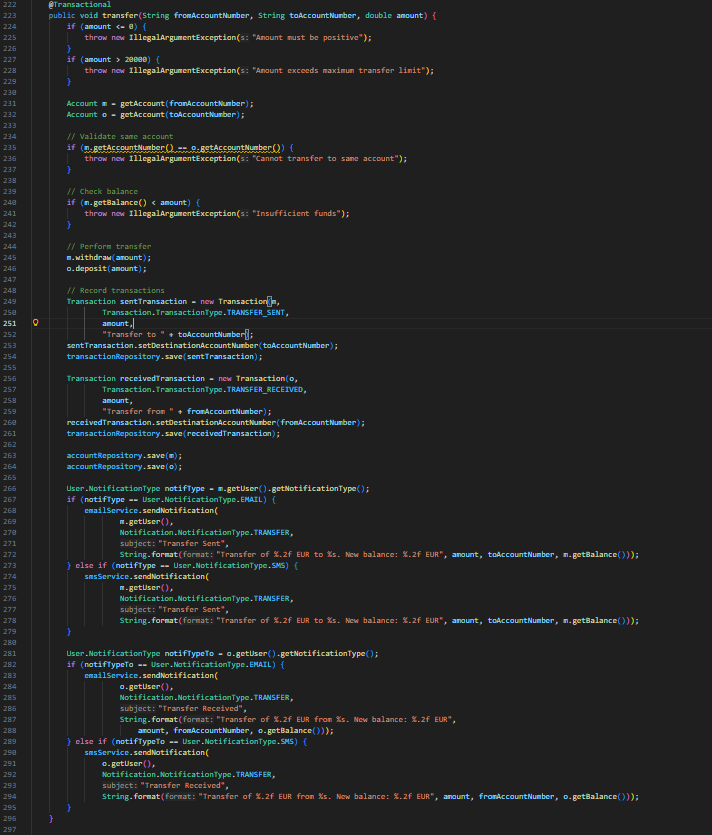
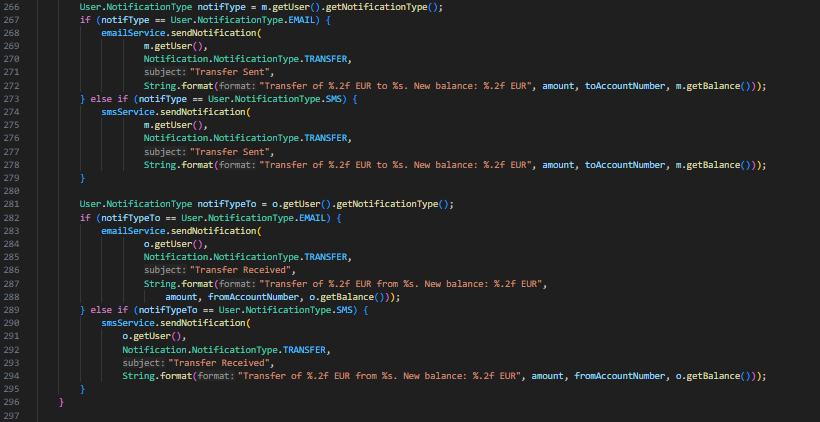

# Práctica 2: Análisis de Calidad del Código (Bad Smells) - Grupo 1

## Integrantes del grupo 1
- Daniel Bonachela Martínez
- Marcelo Atanasio Domínguez Mateo
- Gonzalo Fernández de Córdoba García
- Alejandro García Prada
- Sara Guillén Martínez
- Samuel Melián Benito

## Captura de Pantalla del Overview de SonarQube

## Análisis de Calidad - Issues 

A continuación se muestra un resumen de los issues encontrados en el análisis de calidad realizado con SonarQube y mediante el análisis manual del código:

### Issue 1: Duplicación de Strings (Magic Strings) - Detectado por SonarQube

**Reporte de la issue**:

**Ubicación de la issue**

Clase `AccountService.java`, en múltiples líneas (107, 114, 156, 163)
  
**Explicación de los alumnos del mal olor detectado** 
- El uso de Strings literales repetidos a lo largo del código, lo que usualmente se conoce como *Magic Strings*, hace que el sistema sea algo frágil. En caso de que se necesite modificar este mensaje literal que se repite en múltiples ocasiones (*"Deposit Confirmation"*), habrá que buscar en todo el código ese mensaje y reemplazarlo manualmente. Si olvidamos uno de ellos se pueden crear inconsistencias y comportamientos no esperados.

- Por qué **NO es un falso positivo (Issue real)**: No es un falso positivo puesto que esta repetición de cadenas en 4 ocasiones viola directamente el principio conocido como DRY (*Don't repeat yourself*). Al no tener estos Strings centralizados en variables o constantes, cualquier cambio requerirá modificar la lógica de servicio, lo que aumentará la probabilidad de bugs o inconsistencias como ya hemos comentado anteriormente.

### Issue 2: Nombres de variables y métodos poco descriptivos - Detectado por análisis manual

**Reporte de la issue**:

**Ubicación de la issue**

Clase `AccountService.java`, líneas 231, 232, 301
  
**Explicación de los alumnos del mal olor detectado**
- Hay dos variables de tipo `Account` llamadas `m` y `o`, y en el código no se aporta ningún contexto sobre qué representan (parecen ser cuenta de origen y cuenta de destino, pero lo desconocemos). Obligan a quien lee el código a deducir su propósito leyendo el resto de la función `transfer`. De igual manera, se nombra como `rm` al método para eliminar una cuenta en lugar de darle otro nombre más adecuado como deleteAccount o removeAccount. Estos nombres tan poco descriptivos obligan a estar constantemente "traduciendo" e interpretando el código, lo que dificulta detectar errores lógicos e impacta de forma negativa en la mantenibilidad.

### Issue 9: Métodos excesivamente largos - Detectado por análisis manual

**Reporte de la issue**:

**Ubicación de la issue**

Clase `AccountService.java`, métodos `deposit` (línea 77), `deposit` (línea 126), `withdraw` (línea 175) y `transfer` (línea 223)
  
**Explicación de los alumnos del mal olor detectado**
- Como fue mencionado anteriormente en el *Issue 7*, el código aglutina demasiadas responsabilidades. Esto tiene como consecuencia directa la presencia de métodos excesivamente largos (**Long Methods**) con un bajo grado de cohesión, que presentan código que debería ser extraído a otros métodos auxiliares.

- En los 4 métodos (especialmente en `transfer`), encontramos secciones de código con propósitos diferenciados: comprobación de la cantidad introducida, validación del número de cuenta, comprobación del balance, realización de la operación, registro de la operación o envío de notificaciones. Esto empeora considerablemente la legibilidad del código y deriva en la presencia de comentarios que delimiten y agreguen contexto a las distintas secciones del método.

### Issue 10: Comprobación de tipo mediante ifs-else -  Detectado por análisis manual

**Reporte de la issue**:

**Ubicación de la issue**

Clase `AccountService.java`, métodos `deposit` (línea 102), `deposit` (línea 151), `withdraw` (línea 201) y `transfer` (línea 266)
  
**Explicación de los alumnos del mal olor detectado**

- En los 4 métodos se comprueba el tipo de notificación mediante bloques `if-else` encadenados. Esto se corresponde al bad smell de **Switch Statements**, ya que imposibilita la adición de tipos adicionales sin modificar el código existente (viola el **Open/Closed principle**). Esto resulta en un mayor acoplamiento del código, entorpeciendo tanto su mantenibilidad como su extensibilidad.

