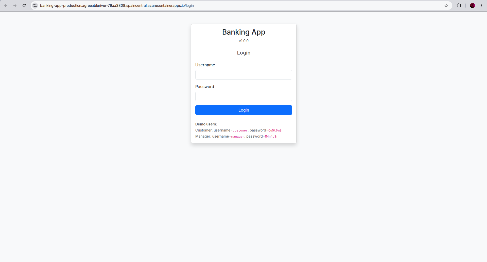
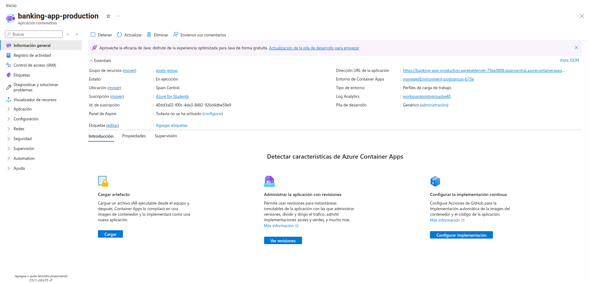

# Praćtica 1 - Control de calidad de una aplicación web 

**Grupo 1**

## Miembros del Equipo
| Nombre y Apellidos | Correo URJC | Usuario GitHub |
|:--- |:--- |:--- |
| Samuel Melián Benito | s.melian.2022@alumnos.urjc.es| SamuelMelian |
| Daniel Bonachela Martínez | d.bonachela.2022@alumnos.urjc.es | fuihfuefuiewn |
| Alejandro García Prada | a.garciap.2022@alumnos.urjc.es | AlexGarciaPrada |
| Marcelo Atanasio Domínguez Mateo | ma.dominguez.2022@alumnos.urjc.es | Sa4dUs |
| Sara Guillén Martínez | s.guillenm.2022@alumnos.urjc.es | saraguillenmtz |
| Gonzalo Fernández de Córdoba García | g.fernandezg.2023@alumnos.urjc.es | gonfdcg |

---

### **Participación de Miembros en la Práctica 1**

#### **Alumno 1 - Samuel Melián Benito**

He cooperado con el equipo en encontrar los bad smells del código. Me he encargado de documentar los issues 1 (Magic Strings) y 2 (Nombres poco descriptivos).

| Nº    | Commits      |
|:------------: |:------------:|
|1| [Issue 1 detectado](https://github.com/cs-2526-grupo-1/cs-2526-grupo-1/commit/60b804c95f69994c1adb6f953dcbb46996c49b2e)  |
|2| [Issue 2 detectado](https://github.com/cs-2526-grupo-1/cs-2526-grupo-1/commit/4b7e0dd59135f38871479b031b09129b6cdc3b82)  |


---

#### **Alumno 2 - Daniel Bonachela Martínez**

He cooperado con el equipo en encontrar los bad smells del código. Me he encargado de documentar los issues 7 (God Class) , 8 (Comentarios inútiles) y 12 (if inalcanzable).

| Nº    | Commits      |
|:------------: |:------------:|
|1| [Issue 7 y 8 detectado](https://github.com/cs-2526-grupo-1/cs-2526-grupo-1/commit/5f21c63efb26938cb07540d4097d3ecd745e655d)  |
|2| [Issue 12 detectado](https://github.com/cs-2526-grupo-1/cs-2526-grupo-1/commit/5ed10910db08395de2620714ce8ede2bc4c85c19)  |

---

#### **Alumno 3 - Alejandro García Prada**

He cooperado con el equipo en encontrar los bad smells del código. Me he encargado de documentar los issues 5 (Comparación incorrecta de string) y  6 (Colisiones Random Numbers).

| Nº    | Commits      |
|:------------: |:------------:|
|1| [Issue 5 detectado](https://github.com/cs-2526-grupo-1/cs-2526-grupo-1/commit/3f52f60c473ad6e4d251292c1260b284b52c89c0)  |
|2| [Issue 6 detectado](https://github.com/cs-2526-grupo-1/cs-2526-grupo-1/commit/14e94cff8ebd5e4763939f8f477f618c08738830)   |

---

#### **Alumno 4 - Marcelo Atanasio Domínguez Mateo**

He cooperado con el equipo en encontrar los bad smells del código. Me he encargado de documentar el issue 11 (Código Duplicado).

| Nº    | Commits      |
|:------------: |:------------:|
|1| [Issue 11 detectado](https://github.com/cs-2526-grupo-1/cs-2526-grupo-1/commit/a0bb0e6127a30da7cbd50a853ab592f15421662e)  |

---

#### **Alumno 5 - Sara Guillén Martínez**

He cooperado con el equipo en encontrar los bad smells del código. Me he encargado de documentar los issues 3 (Variables no utilizadas) y 4 (Mal uso de tipo primitivo).
| Nº    | Commits      |
|:------------: |:------------:|
|1| [Issue 3 y 4 detectado](https://github.com/cs-2526-grupo-1/cs-2526-grupo-1/commit/26017d3e0b849b587689e6fc6c0298ca15173fa5)  |

---

#### **Alumno 6 - Gonzalo Fernández de Córdoba García**

He cooperado con el equipo en encontrar los bad smells del código. Me he encargado de documentar los issues 9 (Métodos largos) y 10 (Comprobación tipo if-else).


| Nº    | Commits      |
|:------------: |:------------:|
|1| [Issue 9 y 10 detectado](https://github.com/cs-2526-grupo-1/cs-2526-grupo-1/commit/1f0ea1ce3c2cc159935f9562d1dbe9389ba45e4f)  |

### **Participación de Miembros en la Práctica 3**

#### **Alumno 1 - Samuel Melián Benito**

En primer lugar monté la estructura para los test de selenium. He implementado el test unitario para el método `withdraw`. Asímismo, he movido las implementaciones relacionadas con las Issues octava y novena. Por último, he creado los test E2E 5 y 6. Que corresponden con las cuestiones: "No se puede realizar una transferencia si la cantidad es negativa" y "No se puede realizar una transferencia si la cantidad supera los 20.000€". Luego, además, apoyé al equipo con refactors complementarios.

| Nº    | Commits      |
|:------------: |:------------:|
|1| [Issue 8](https://github.com/cs-2526-grupo-1/cs-2526-grupo-1/commit/2cfad2e24dd8ac5c7335e90a36770d9439c997c5)  |
|2| [Issue 9](https://github.com/cs-2526-grupo-1/cs-2526-grupo-1/commit/8693028a816f127fcf81be2eaa92a421a759606d)  |
|3| [Refactor complementario en tests](https://github.com/cs-2526-grupo-1/cs-2526-grupo-1/commit/5d4be2361ba9c2b8bfb64c181e0952d5c3b1bdb3)  |
|4| [Test 6 E2E](https://github.com/cs-2526-grupo-1/cs-2526-grupo-1/commit/0a659ed944f0e33572869171b1583d98ebc4d912)  |
|5| [Estructura test selenium](https://github.com/cs-2526-grupo-1/cs-2526-grupo-1/commit/73d366da4b38d25eb4648353b98cd90c78ca9ce3)  |
|6| [Account Service test refactor](https://github.com/cs-2526-grupo-1/cs-2526-grupo-1/commit/56dffb89e9b5e878028b7a55e4b1050b7aacdde4)  |


---

#### **Alumno 2 - Daniel Bonachela Martínez**

He implementado test unitarios para los métodos `createAccount` así como la segunda parte del método `deposit`. Por otro lado, he gestionado las implementaciones relacionadas con la Issue 4 y 12. Por último, he implementado el segundo test E2E para comprobar "Se puede realizar una transferencia entre cuentas de distintos usuarios". Además, de ahí saqué una lógica común con el primer test.

| Nº    | Commits      |
|:------------: |:------------:|
|1| [Unificación de lógica de test](https://github.com/cs-2526-grupo-1/cs-2526-grupo-1/commit/242d1a5fdf7e198d2ecbddf4e636077f399b81c6)  |
|2| [Implementación test 2 E2E](https://github.com/cs-2526-grupo-1/cs-2526-grupo-1/commit/6bb918f6e57664f5a5d49e7d00117120de651080)  |
|3| [Issue 12 y 4 refactor](https://github.com/cs-2526-grupo-1/cs-2526-grupo-1/commit/91280579061dc0b3282f5d809445717b41385368)  |
|4| [Test Deposit Segunda Parte](https://github.com/cs-2526-grupo-1/cs-2526-grupo-1/commit/040fb2f1349cc35e966ebf78c4c2430122c66bc7)  |
|5| [Test Deposit Primera Parte](https://github.com/cs-2526-grupo-1/cs-2526-grupo-1/commit/c094ab9948b7f22bfd4384ff9e99db23e3318cb1)  |


---

#### **Alumno 3 - Alejandro García Prada**

He implementado test unitarios para los métodos `generateAccountNumber` y también la primera de las partes de `deposit`. Seguidamente he realizado las implementaciones vinculadas a la Issues 5 y 6. Para acabar realicé el séptimo test E2E para comprobrar "No se puede realizar una transferencia a una cuenta inválida/que no existe". Como añadido, realicé el refactor para centralizar la gestión de constantes en los diferentes tests.

| Nº    | Commits      |
|:------------: |:------------:|
|1| [Implementación test 7 E2E](https://github.com/cs-2526-grupo-1/cs-2526-grupo-1/commit/54f57dc402369e05f267fe7c305e442974a9336f)  |
|2| [Issue 5 refactor](https://github.com/cs-2526-grupo-1/cs-2526-grupo-1/commit/787b69459fdc18332fe83f414b67d9b3abd65798)   |
|3| [Issue 6 refactor](https://github.com/cs-2526-grupo-1/cs-2526-grupo-1/commit/e4abe77e6c34791a036f245f9b0cd88ee62c0e10)   |
|4| [Refactor de constantes](https://github.com/cs-2526-grupo-1/cs-2526-grupo-1/commit/1efd2c29674f37ddb9982d4e438a33160453a696)   |
|5| [Test generador de cuenta](https://github.com/cs-2526-grupo-1/cs-2526-grupo-1/commit/976e7b7486d31d92272b3ca4213648ddaeb0a89e)   |
|6| [Ifs del test de deposit](https://github.com/cs-2526-grupo-1/cs-2526-grupo-1/commit/8e8b77ef639c1801db95b4eb0b33a23b9a33362e)   |


---


#### **Alumno 4 - Marcelo Atanasio Domínguez Mateo**

He implementado test unitarios para los métodos `getBalance`, `getTransactions` y la segunda mitad de `transfer`. He llevado a cabo las refactorizaciones correspondientes al Issue 7 y al Issue 11. He implementado el test E2E para comprobar que: "Se puede realizar una transferencia entre cuentas propias (de una cuenta corriente a una de ahorros)".

| Nº    | Commits      |
|:------------: |:------------:|
|1| [Add `getBalance` unit tests](https://github.com/cs-2526-grupo-1/cs-2526-grupo-1/commit/a1b7095f9e7c2bca7cce93f96b123261cb44cbfa)  |
|2| [Add `getTransactions` unit tests](https://github.com/cs-2526-grupo-1/cs-2526-grupo-1/commit/c1af9c9dddfbe68f22e74e924f0c200f0e2dd66d)  |
|3| [Add `transfer` (2nd part) unit tests](https://github.com/cs-2526-grupo-1/cs-2526-grupo-1/commit/02b3e600ef479098d4bfe6ac32867a722eab8186)  |
|4| [Remove code duplication on `deposit`](https://github.com/cs-2526-grupo-1/cs-2526-grupo-1/commit/278e4430b71a75b511a66607baef5f1b750da58f)  |
|5| [Extract notification and validation logic from AccountService into dedicated service classes](https://github.com/cs-2526-grupo-1/cs-2526-grupo-1/commit/7d7d27217bd89f108a2267fcfac92429f822a9da)  |
|6| [Add E2E test for internal transfers](https://github.com/cs-2526-grupo-1/cs-2526-grupo-1/commit/461a43e61bb429fc874dcd45ad3a939b6edd89f0)  |

---

#### **Alumno 5 - Sara Guillén Martínez**

He implementado test unitarios para los métodos `removeAccount` y también de `getUserAccounts`. También, he llevado a cabo los refactors que corresponden a las Issues 1 y 2. A parte, contribuí en los test E2E realizando el cuarto, que corresponde a "No se puede realizar una transferencia si no hay saldo suficiente".

| Nº    | Commits      |
|:------------: |:------------:|
|1| [Add test for getUserAccounts method](https://github.com/cs-2526-grupo-1/cs-2526-grupo-1/commit/8e651f6b83bc42e50a8af23821b6e135c87b0395)  |
|2| [Add test for account removal with non-zero balance](https://github.com/cs-2526-grupo-1/cs-2526-grupo-1/commit/101343e000365f5ddc2c68917d493325189b1ad7)  |
|3| [Add test for account removal with zero balance](https://github.com/cs-2526-grupo-1/cs-2526-grupo-1/commit/4f149969798eca6c4f0f3babd680c0ab01621117)  |
|4| [Add test 4 for transfer with exceeding amount](https://github.com/cs-2526-grupo-1/cs-2526-grupo-1/commit/79abc5e76b5b6b02c9314fbf57fbfd4e3d047e21)  |
|5| [Add test 4 for transfer with exceeding amount](https://github.com/cs-2526-grupo-1/cs-2526-grupo-1/commit/79abc5e76b5b6b02c9314fbf57fbfd4e3d047e21)  |
|6| [Refactor for issue 1: magic strings](https://github.com/cs-2526-grupo-1/cs-2526-grupo-1/commit/37cd784f676a2d047158103bcae423bdeed1d40e)  |
|7| [Refactor issue 2: account transfer names](https://github.com/cs-2526-grupo-1/cs-2526-grupo-1/commit/abba8199a28e18b4fd11dcece90a5f5bd200881a)  |
|8| [Rename rm method to removeAccount in tests](https://github.com/cs-2526-grupo-1/cs-2526-grupo-1/commit/524ec376531aee24ce795e5303f2ec2395537b3d)  |


---

#### **Alumno 6 - Gonzalo Fernández de Córdoba García**

He implementado test unitarios para el métodos `getAccount` y la primera mitad de `transfer`. He llevado a cabo las refactorizaciones de los Issues 3 y 10. Contribuí en los tests E2E realizando el 3er test, que comprueba que "No se puede realizar una transferencia de una cuenta a la misma cuenta".

| Nº    | Commits      |
|:------------: |:------------:|
|1| ['getAccount_ExistingAccount_returnsAccount test'](https://github.com/cs-2526-grupo-1/cs-2526-grupo-1/commit/2bf79311aa7388ae994f4f75c0b2ae2b7ee3dc0c)  |
|2| [getAccount_nonExistingAccount_throwsExceptiontest](https://github.com/cs-2526-grupo-1/cs-2526-grupo-1/commit/6b8fd2c6586ddbe3177cfeaf23b51b9331402600)  |
|3| [`transfer` 1st part tests ](https://github.com/cs-2526-grupo-1/cs-2526-grupo-1/commit/0a238f38a51b79b9050f5f4de523d0d9f611f7a2)  |
|4| [variable seccondAccount removed](https://github.com/cs-2526-grupo-1/cs-2526-grupo-1/commit/f741fe5f4d6035f13add9e3c75d950491569d054)  |
|5| [Issue10-refactored](https://github.com/cs-2526-grupo-1/cs-2526-grupo-1/commit/43289c1a33bf5738835c05622e2f1cda0d12a2da)  |
|6| [Test 3 E2E Transfer to Same Account](https://github.com/cs-2526-grupo-1/cs-2526-grupo-1/commit/0a75f183182aa1cdbc7e496d6c69fefca00e59fd)  |


# Praćtica 4 - Implementación de pipelines de CI-CD y desarrollo colaborativo 


### Captura de la aplicación desplegada en Azure





### Captura del dashboard de Azure con la última versión desplegada




## Desarrollo con GitHubFlow

### Asignación de tareas

| Tarea | Alumno/es asignado/s | Commits asociado |
|:--- |:--- |:--- |
| feature-1 | Marcelo Atanasio Domínguez Mateo, Alejandro García Prada | [Implement last 24h withdraw limit](https://github.com/cs-2526-grupo-1/cs-2526-grupo-1/commit/c0a58801dd268af19f125c44986f353142a1a9c4), [24h withdrawal Test](https://github.com/cs-2526-grupo-1/cs-2526-grupo-1/commit/8eb103edd97ab643371f4b23cfbac4074ba68c5d) |
| feature-2 | Gonzalo Fernández de Córdoba García, Daniel Bonachela Martínez | [feature2 functionality](https://github.com/cs-2526-grupo-1/cs-2526-grupo-1/commit/69d8edf9b0f353b5af50d534ef2dbac51ccb7bbf), [Banned Test](https://github.com/cs-2526-grupo-1/cs-2526-grupo-1/commit/e0dd06ea66bcff88152de8385dd6400049765913) |
| feature-3 | Samuel Melián Benito, Sara Guillén Martínez  | [Add feature-3. Birthdate in users and check > 18 years to transfer money](https://github.com/cs-2526-grupo-1/cs-2526-grupo-1/commit/38c77b4c96aa139ec40e8bc0678bab263564ad9f), [Feat: add tests to check user age when transfering](https://github.com/cs-2526-grupo-1/cs-2526-grupo-1/commit/cf13fed933142a90e4f82a871d584d3d052aafbe) |
>| refactoring-1 | [Nombre 5] | [Commit 5](URL_commit_5) ... | Nosotros no tenemos esto

### Pasos seguidos

Una vez creados los workflows y funcionando estos, pasamos a crear la nueva funcionalidad utilizando GithubFlow:

Clonamos el repositorio

```
$ git clone git@github.com:codigus-formacion-se/banking-app-2026.git
```

> Inserta aquí todos los comandos que has utilizado para crear la rama, implementar la funcionalidad, hacer el commit y push a GitHub, crear el pull request y hacer el merge a main. Acompaña cada comando con una breve explicación de lo que has hecho.

## Workflow 4

Todos los días a las XX:XX se ejecuta el job de Nightly que ...

- [ÚLTIMA EJECUCIÓN](URL_ultima_ejecucion_workflow_4)
