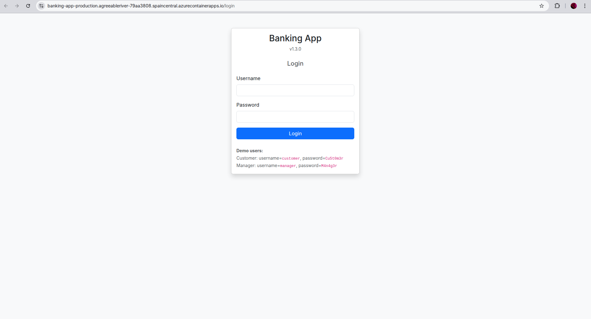

# Praćtica 1 - Control de calidad de una aplicación web 

**Grupo 1**

## Miembros del Equipo
| Nombre y Apellidos | Correo URJC | Usuario GitHub |
|:--- |:--- |:--- |
| Samuel Melián Benito | s.melian.2022@alumnos.urjc.es| SamuelMelian |
| Daniel Bonachela Martínez | d.bonachela.2022@alumnos.urjc.es | fuihfuefuiewn |
| Alejandro García Prada | a.garciap.2022@alumnos.urjc.es | AlexGarciaPrada |
| Marcelo Atanasio Domínguez Mateo | ma.dominguez.2022@alumnos.urjc.es | Sa4dUs |
| Sara Guillén Martínez | s.guillenm.2022@alumnos.urjc.es | saraguillenmtz |
| Gonzalo Fernández de Córdoba García | g.fernandezg.2023@alumnos.urjc.es | gonfdcg |

---

### **Participación de Miembros en la Práctica 1**

#### **Alumno 1 - Samuel Melián Benito**

He cooperado con el equipo en encontrar los bad smells del código. Me he encargado de documentar los issues 1 (Magic Strings) y 2 (Nombres poco descriptivos).

| Nº    | Commits      |
|:------------: |:------------:|
|1| [Issue 1 detectado](https://github.com/cs-2526-grupo-1/cs-2526-grupo-1/commit/60b804c95f69994c1adb6f953dcbb46996c49b2e)  |
|2| [Issue 2 detectado](https://github.com/cs-2526-grupo-1/cs-2526-grupo-1/commit/4b7e0dd59135f38871479b031b09129b6cdc3b82)  |


---

#### **Alumno 2 - Daniel Bonachela Martínez**

He cooperado con el equipo en encontrar los bad smells del código. Me he encargado de documentar los issues 7 (God Class) , 8 (Comentarios inútiles) y 12 (if inalcanzable).

| Nº    | Commits      |
|:------------: |:------------:|
|1| [Issue 7 y 8 detectado](https://github.com/cs-2526-grupo-1/cs-2526-grupo-1/commit/5f21c63efb26938cb07540d4097d3ecd745e655d)  |
|2| [Issue 12 detectado](https://github.com/cs-2526-grupo-1/cs-2526-grupo-1/commit/5ed10910db08395de2620714ce8ede2bc4c85c19)  |

---

#### **Alumno 3 - Alejandro García Prada**

He cooperado con el equipo en encontrar los bad smells del código. Me he encargado de documentar los issues 5 (Comparación incorrecta de string) y  6 (Colisiones Random Numbers).

| Nº    | Commits      |
|:------------: |:------------:|
|1| [Issue 5 detectado](https://github.com/cs-2526-grupo-1/cs-2526-grupo-1/commit/3f52f60c473ad6e4d251292c1260b284b52c89c0)  |
|2| [Issue 6 detectado](https://github.com/cs-2526-grupo-1/cs-2526-grupo-1/commit/14e94cff8ebd5e4763939f8f477f618c08738830)   |

---

#### **Alumno 4 - Marcelo Atanasio Domínguez Mateo**

He cooperado con el equipo en encontrar los bad smells del código. Me he encargado de documentar el issue 11 (Código Duplicado).

| Nº    | Commits      |
|:------------: |:------------:|
|1| [Issue 11 detectado](https://github.com/cs-2526-grupo-1/cs-2526-grupo-1/commit/a0bb0e6127a30da7cbd50a853ab592f15421662e)  |

---

#### **Alumno 5 - Sara Guillén Martínez**

He cooperado con el equipo en encontrar los bad smells del código. Me he encargado de documentar los issues 3 (Variables no utilizadas) y 4 (Mal uso de tipo primitivo).
| Nº    | Commits      |
|:------------: |:------------:|
|1| [Issue 3 y 4 detectado](https://github.com/cs-2526-grupo-1/cs-2526-grupo-1/commit/26017d3e0b849b587689e6fc6c0298ca15173fa5)  |

---

#### **Alumno 6 - Gonzalo Fernández de Córdoba García**

He cooperado con el equipo en encontrar los bad smells del código. Me he encargado de documentar los issues 9 (Métodos largos) y 10 (Comprobación tipo if-else).


| Nº    | Commits      |
|:------------: |:------------:|
|1| [Issue 9 y 10 detectado](https://github.com/cs-2526-grupo-1/cs-2526-grupo-1/commit/1f0ea1ce3c2cc159935f9562d1dbe9389ba45e4f)  |

### **Participación de Miembros en la Práctica 3**

#### **Alumno 1 - Samuel Melián Benito**

En primer lugar monté la estructura para los test de selenium. He implementado el test unitario para el método `withdraw`. Asímismo, he movido las implementaciones relacionadas con las Issues octava y novena. Por último, he creado los test E2E 5 y 6. Que corresponden con las cuestiones: "No se puede realizar una transferencia si la cantidad es negativa" y "No se puede realizar una transferencia si la cantidad supera los 20.000€". Luego, además, apoyé al equipo con refactors complementarios.

| Nº    | Commits      |
|:------------: |:------------:|
|1| [Issue 8](https://github.com/cs-2526-grupo-1/cs-2526-grupo-1/commit/2cfad2e24dd8ac5c7335e90a36770d9439c997c5)  |
|2| [Issue 9](https://github.com/cs-2526-grupo-1/cs-2526-grupo-1/commit/8693028a816f127fcf81be2eaa92a421a759606d)  |
|3| [Refactor complementario en tests](https://github.com/cs-2526-grupo-1/cs-2526-grupo-1/commit/5d4be2361ba9c2b8bfb64c181e0952d5c3b1bdb3)  |
|4| [Test 6 E2E](https://github.com/cs-2526-grupo-1/cs-2526-grupo-1/commit/0a659ed944f0e33572869171b1583d98ebc4d912)  |
|5| [Estructura test selenium](https://github.com/cs-2526-grupo-1/cs-2526-grupo-1/commit/73d366da4b38d25eb4648353b98cd90c78ca9ce3)  |
|6| [Account Service test refactor](https://github.com/cs-2526-grupo-1/cs-2526-grupo-1/commit/56dffb89e9b5e878028b7a55e4b1050b7aacdde4)  |


---

#### **Alumno 2 - Daniel Bonachela Martínez**

He implementado test unitarios para los métodos `createAccount` así como la segunda parte del método `deposit`. Por otro lado, he gestionado las implementaciones relacionadas con la Issue 4 y 12. Por último, he implementado el segundo test E2E para comprobar "Se puede realizar una transferencia entre cuentas de distintos usuarios". Además, de ahí saqué una lógica común con el primer test.

| Nº    | Commits      |
|:------------: |:------------:|
|1| [Unificación de lógica de test](https://github.com/cs-2526-grupo-1/cs-2526-grupo-1/commit/242d1a5fdf7e198d2ecbddf4e636077f399b81c6)  |
|2| [Implementación test 2 E2E](https://github.com/cs-2526-grupo-1/cs-2526-grupo-1/commit/6bb918f6e57664f5a5d49e7d00117120de651080)  |
|3| [Issue 12 y 4 refactor](https://github.com/cs-2526-grupo-1/cs-2526-grupo-1/commit/91280579061dc0b3282f5d809445717b41385368)  |
|4| [Test Deposit Segunda Parte](https://github.com/cs-2526-grupo-1/cs-2526-grupo-1/commit/040fb2f1349cc35e966ebf78c4c2430122c66bc7)  |
|5| [Test Deposit Primera Parte](https://github.com/cs-2526-grupo-1/cs-2526-grupo-1/commit/c094ab9948b7f22bfd4384ff9e99db23e3318cb1)  |


---

#### **Alumno 3 - Alejandro García Prada**

He implementado test unitarios para los métodos `generateAccountNumber` y también la primera de las partes de `deposit`. Seguidamente he realizado las implementaciones vinculadas a la Issues 5 y 6. Para acabar realicé el séptimo test E2E para comprobrar "No se puede realizar una transferencia a una cuenta inválida/que no existe". Como añadido, realicé el refactor para centralizar la gestión de constantes en los diferentes tests.

| Nº    | Commits      |
|:------------: |:------------:|
|1| [Implementación test 7 E2E](https://github.com/cs-2526-grupo-1/cs-2526-grupo-1/commit/54f57dc402369e05f267fe7c305e442974a9336f)  |
|2| [Issue 5 refactor](https://github.com/cs-2526-grupo-1/cs-2526-grupo-1/commit/787b69459fdc18332fe83f414b67d9b3abd65798)   |
|3| [Issue 6 refactor](https://github.com/cs-2526-grupo-1/cs-2526-grupo-1/commit/e4abe77e6c34791a036f245f9b0cd88ee62c0e10)   |
|4| [Refactor de constantes](https://github.com/cs-2526-grupo-1/cs-2526-grupo-1/commit/1efd2c29674f37ddb9982d4e438a33160453a696)   |
|5| [Test generador de cuenta](https://github.com/cs-2526-grupo-1/cs-2526-grupo-1/commit/976e7b7486d31d92272b3ca4213648ddaeb0a89e)   |
|6| [Ifs del test de deposit](https://github.com/cs-2526-grupo-1/cs-2526-grupo-1/commit/8e8b77ef639c1801db95b4eb0b33a23b9a33362e)   |


---


#### **Alumno 4 - Marcelo Atanasio Domínguez Mateo**

He implementado test unitarios para los métodos `getBalance`, `getTransactions` y la segunda mitad de `transfer`. He llevado a cabo las refactorizaciones correspondientes al Issue 7 y al Issue 11. He implementado el test E2E para comprobar que: "Se puede realizar una transferencia entre cuentas propias (de una cuenta corriente a una de ahorros)".

| Nº    | Commits      |
|:------------: |:------------:|
|1| [Add `getBalance` unit tests](https://github.com/cs-2526-grupo-1/cs-2526-grupo-1/commit/a1b7095f9e7c2bca7cce93f96b123261cb44cbfa)  |
|2| [Add `getTransactions` unit tests](https://github.com/cs-2526-grupo-1/cs-2526-grupo-1/commit/c1af9c9dddfbe68f22e74e924f0c200f0e2dd66d)  |
|3| [Add `transfer` (2nd part) unit tests](https://github.com/cs-2526-grupo-1/cs-2526-grupo-1/commit/02b3e600ef479098d4bfe6ac32867a722eab8186)  |
|4| [Remove code duplication on `deposit`](https://github.com/cs-2526-grupo-1/cs-2526-grupo-1/commit/278e4430b71a75b511a66607baef5f1b750da58f)  |
|5| [Extract notification and validation logic from AccountService into dedicated service classes](https://github.com/cs-2526-grupo-1/cs-2526-grupo-1/commit/7d7d27217bd89f108a2267fcfac92429f822a9da)  |
|6| [Add E2E test for internal transfers](https://github.com/cs-2526-grupo-1/cs-2526-grupo-1/commit/461a43e61bb429fc874dcd45ad3a939b6edd89f0)  |

---

#### **Alumno 5 - Sara Guillén Martínez**

He implementado test unitarios para los métodos `removeAccount` y también de `getUserAccounts`. También, he llevado a cabo los refactors que corresponden a las Issues 1 y 2. A parte, contribuí en los test E2E realizando el cuarto, que corresponde a "No se puede realizar una transferencia si no hay saldo suficiente".

| Nº    | Commits      |
|:------------: |:------------:|
|1| [Add test for getUserAccounts method](https://github.com/cs-2526-grupo-1/cs-2526-grupo-1/commit/8e651f6b83bc42e50a8af23821b6e135c87b0395)  |
|2| [Add test for account removal with non-zero balance](https://github.com/cs-2526-grupo-1/cs-2526-grupo-1/commit/101343e000365f5ddc2c68917d493325189b1ad7)  |
|3| [Add test for account removal with zero balance](https://github.com/cs-2526-grupo-1/cs-2526-grupo-1/commit/4f149969798eca6c4f0f3babd680c0ab01621117)  |
|4| [Add test 4 for transfer with exceeding amount](https://github.com/cs-2526-grupo-1/cs-2526-grupo-1/commit/79abc5e76b5b6b02c9314fbf57fbfd4e3d047e21)  |
|5| [Add test 4 for transfer with exceeding amount](https://github.com/cs-2526-grupo-1/cs-2526-grupo-1/commit/79abc5e76b5b6b02c9314fbf57fbfd4e3d047e21)  |
|6| [Refactor for issue 1: magic strings](https://github.com/cs-2526-grupo-1/cs-2526-grupo-1/commit/37cd784f676a2d047158103bcae423bdeed1d40e)  |
|7| [Refactor issue 2: account transfer names](https://github.com/cs-2526-grupo-1/cs-2526-grupo-1/commit/abba8199a28e18b4fd11dcece90a5f5bd200881a)  |
|8| [Rename rm method to removeAccount in tests](https://github.com/cs-2526-grupo-1/cs-2526-grupo-1/commit/524ec376531aee24ce795e5303f2ec2395537b3d)  |


---

#### **Alumno 6 - Gonzalo Fernández de Córdoba García**

He implementado test unitarios para el métodos `getAccount` y la primera mitad de `transfer`. He llevado a cabo las refactorizaciones de los Issues 3 y 10. Contribuí en los tests E2E realizando el 3er test, que comprueba que "No se puede realizar una transferencia de una cuenta a la misma cuenta".

| Nº    | Commits      |
|:------------: |:------------:|
|1| ['getAccount_ExistingAccount_returnsAccount test'](https://github.com/cs-2526-grupo-1/cs-2526-grupo-1/commit/2bf79311aa7388ae994f4f75c0b2ae2b7ee3dc0c)  |
|2| [getAccount_nonExistingAccount_throwsExceptiontest](https://github.com/cs-2526-grupo-1/cs-2526-grupo-1/commit/6b8fd2c6586ddbe3177cfeaf23b51b9331402600)  |
|3| [`transfer` 1st part tests ](https://github.com/cs-2526-grupo-1/cs-2526-grupo-1/commit/0a238f38a51b79b9050f5f4de523d0d9f611f7a2)  |
|4| [variable seccondAccount removed](https://github.com/cs-2526-grupo-1/cs-2526-grupo-1/commit/f741fe5f4d6035f13add9e3c75d950491569d054)  |
|5| [Issue10-refactored](https://github.com/cs-2526-grupo-1/cs-2526-grupo-1/commit/43289c1a33bf5738835c05622e2f1cda0d12a2da)  |
|6| [Test 3 E2E Transfer to Same Account](https://github.com/cs-2526-grupo-1/cs-2526-grupo-1/commit/0a75f183182aa1cdbc7e496d6c69fefca00e59fd)  |


# Praćtica 4 - Implementación de pipelines de CI-CD y desarrollo colaborativo 


### Captura de la aplicación desplegada en Azure





### Captura del dashboard de Azure con la última versión desplegada


## Desarrollo con GitHubFlow

### Asignación de tareas

| Tarea | Alumnos asignados | Commits asociados |
|:--- |:--- |:--- |
| feature-1 | Marcelo Atanasio Domínguez Mateo, Alejandro García Prada | [Implement last 24h withdraw limit](https://github.com/cs-2526-grupo-1/cs-2526-grupo-1/commit/c0a58801dd268af19f125c44986f353142a1a9c4), [24h withdrawal Test](https://github.com/cs-2526-grupo-1/cs-2526-grupo-1/commit/8eb103edd97ab643371f4b23cfbac4074ba68c5d) |
| feature-2 | Gonzalo Fernández de Córdoba García, Daniel Bonachela Martínez | [feature2 functionality](https://github.com/cs-2526-grupo-1/cs-2526-grupo-1/commit/69d8edf9b0f353b5af50d534ef2dbac51ccb7bbf), [Banned Test](https://github.com/cs-2526-grupo-1/cs-2526-grupo-1/commit/e0dd06ea66bcff88152de8385dd6400049765913) |
| feature-3 | Samuel Melián Benito, Sara Guillén Martínez  | [Add feature-3. Birthdate in users and check > 18 years to transfer money](https://github.com/cs-2526-grupo-1/cs-2526-grupo-1/commit/38c77b4c96aa139ec40e8bc0678bab263564ad9f), [Feat: add tests to check user age when transfering](https://github.com/cs-2526-grupo-1/cs-2526-grupo-1/commit/cf13fed933142a90e4f82a871d584d3d052aafbe) |

#### Desglose detallado de contribuciones individuales:

* **Marcelo Atanasio Domínguez Mateo:** Responsable de la configuración inicial del entorno de desarrollo (Paso 1), diseño e implementación de la lógica de negocio de la `feature-1` (Límite de retirada 24h) y desarrollo técnico de los pipelines de integración continua **Workflow 1** (Unit Testing on Commit), **Workflow 2** (Unit + E2E Testing on PR) y **Workflow 4** (Nightly Matrix Test con entornos distribuidos).
* **Alejandro García Prada:** Responsable del diseño y ejecución de la batería completa de pruebas unitarias y de integración para asegurar la robustez de la `feature-1`.
* **Gonzalo Fernández de Córdoba García:** Responsable del diseño e implementación de la lógica de negocio de la `feature-2` (Baneo de usuarios) y desarrollo de los pipelines críticos de infraestructura de **Workflow 3** (Build and Deploy on Push en Azure).
* **Daniel Bonachela Martínez:** Responsable de la creación del entorno de constantes de prueba, así como del diseño, implementación y validación de la suite de tests unitarios asociados a la lógica de baneo de la `feature-2`.
* **Samuel Melián Benito:** Responsable de la implementación del modelo de datos (añadiendo la fecha de nacimiento) y del desarrollo de las reglas de validación de mayoría de edad para las transferencias en la `feature-3`.
* **Sara Guillén Martínez:** Responsable de la cobertura de código, asegurando la calidad de la `feature-3` mediante la suite de tests unitarios de validación de edad.

Se adjunta aquí mismo un desglose de los commits de creación de los workflows:
| Tarea | Alumno asignado | Commits asociado |
|:--- |:--- |:--- |
| workflow-1 | Marcelo Atanasio Domínguez Mateo | [Add github workflow1](https://github.com/cs-2526-grupo-1/cs-2526-grupo-1/commit/4c48b92ebda104b6a070fc4d49a4a45be90b0bcf) |
| workflow-2 | Marcelo Atanasio Domínguez Mateo | [Add github workflow2](https://github.com/cs-2526-grupo-1/cs-2526-grupo-1/commit/5ff6e201033beaf5ad8553a5af0bbe58a90ef14a) |
| workflow-3 | Gonzalo Fernández de Córdoba García | [Add Azure CD Workflow 3](https://github.com/cs-2526-grupo-1/cs-2526-grupo-1/commit/671a59afd44962c3e01d8746aa693872c21eac9e) |
| workflow-4 | Marcelo Atanasio Domínguez Mateo | [Add github workflow4](https://github.com/cs-2526-grupo-1/cs-2526-grupo-1/commit/10dc9416948176f8fed510b7e497772b7c07f282) |

### Pasos seguidos

Una vez creados los workflows y funcionando estos, pasamos a crear la nueva funcionalidad utilizando GithubFlow:

Clonamos el repositorio

```bash
$ git clone git@github.com:cs-2526-grupo-1/cs-2526-grupo-1.git
```

A partir de aquí, el equipo trabajó en paralelo siguiendo una estrategia estricta de ramificación, actualización de versiones (**SemVer**) e integración continua. A continuación, se detallan los comandos cronológicos y pasos seguidos para el desarrollo de las funcionalidades:
#### Feature 1
* **Asignados:** Marcelo Atanasio Domínguez Mateo y Alejandro García Prada.

El equipo se sitúa en `main`, se asegura de tener la última versión y crea la rama local para la primera funcionalidad:
```bash
$ git checkout main
$ git pull origin main
$ git checkout -b feature-1
```
Se implementa la lógica del límite de retirada de 24 horas en el servicio y se desarrollan sus correspondientes tests unitarios. Siguiendo el versionado semántico, se modifica el `pom.xml` para establecer la versión **1.1.0** (nueva funcionalidad menor).

Se añaden los archivos, se realizan los commits descriptivos y se sube la rama al repositorio remoto:
```bash
$ git add .
$ git commit -m "Implement last 24h withdraw limit"
$ git commit -m "24h withdrawal Test"
$ git commit -m "Extra Test for simulating not transactions"
$ git push origin feature-1
```
> **Acción en GitHub:** Se abre el Pull Request (PR #52) de `feature-1` hacia `main`. Esto dispara automáticamente el **Workflow 2** (verificación de calidad y tests). Tras pasar los checks sin errores, se realiza el Merge integrado, lo que ejecuta el **Workflow 3** y despliega de manera automática la versión **1.1.0** en Azure.

#### Feature 2
* **Asignados:** Gonzalo Fernández de Córdoba García y Daniel Bonachela Martínez.

Para trabajar en la segunda funcionalidad sin interferir con la primera, se crea la rama correspondiente desde el estado actual:

```bash
$ git checkout main
$ git pull origin main
$ git checkout -b feature-2
```

Se desarrolla el control de baneo en las operaciones financieras (bloqueando depósitos, retiradas y transferencias) y se añaden los tests unitarios para validar las excepciones. Al ser otra funcionalidad que añade valor al negocio, se actualiza el `pom.xml` a la versión **1.2.0**.

Se preparan los cambios, se realizan los commits correspondientes al código y a las pruebas, y se publica la rama:

```bash
$ git add .
$ git commit -m "feature2 functionality"
$ git commit -m "Banned Test"
$ git push origin feature-2
```

> **Acción en GitHub:** Se abre el Pull Request (PR #53) de `feature-2` hacia `main`. El **Workflow 2** valida la compilación y la cobertura de código. Al completarse el Merge, el **Workflow 3** toma el relevo actualizando el entorno de producción en Azure.

---

#### Feature 3
* **Asignados:** Samuel Melián Benito y Sara Guillén Martínez.

El tercer equipo actualiza su copia local de `main` (que ya contiene las características 1 y 2) y abre su línea de trabajo:

```bash
$ git checkout main
$ git pull origin main
$ git checkout -b feature-3
```

Se añade el campo de fecha de nacimiento al modelo de usuario, la validación de mayores de 18 años en el flujo de transferencias y su batería de pruebas de software. El fichero `pom.xml` se incrementa a la versión **1.3.0**.

Se registran los cambios mediante commits firmados y se suben a la plataforma:

```bash
$ git add .
$ git commit -m "Add feature-3. Birthdate in users and check > 18 years to transfer money"
$ git commit -m "Add underage transfer message constant"
$ git commit -m "Feat: add tests to check user age when transfering"
$ git push origin feature-3
```

> **Acción en GitHub:** Se genera el Pull Request (PR #54). Una vez que el pipeline del **Workflow 2** da la luz verde asegurando que no rompe ninguna de las funcionalidades previas, se aprueba el Merge. La versión final corporativa **1.3.0** queda desplegada de forma automática en Azure por el **Workflow 3**.


## Arquitectura de CI/CD: Automatización con GitHub Actions

Para garantizar la calidad del software, la estabilidad de la rama principal y la entrega continua en el entorno de producción, se han implementado 4 flujos de trabajo (workflows) automatizados.

---

### Workflow 1: Unit Testing on Commit
Este pipeline actúa como la primera línea de defensa. Se ejecuta de manera aislada en las ramas de desarrollo para asegurar que ningún cambio local rompa las reglas de negocio básicas antes de proponer una integración.

* **Disparador (Trigger):** Cualquier `push` en ramas distintas a `main` (excluyendo cambios en documentación o archivos de configuración del propio workflow). Cuenta también con ejecución manual (`workflow_dispatch`).
* **Tareas principales (Jobs):**
    * **`unit-tests`:** Levanta un entorno Linux, configura Java 21 (Temurin) y ejecuta exclusivamente la suite de pruebas unitarias (`mvn test -Dtest=es.codeurjc.unit.**.*`).

- **[Update AccountServiceTestConstants.java](https://github.com/cs-2526-grupo-1/cs-2526-grupo-1/actions/runs/26468184352)**
- **[Bump version from 1.1.0 to 1.2.0](https://github.com/cs-2526-grupo-1/cs-2526-grupo-1/actions/runs/26467521589)**
- **[Bump version from 1.0.0 to 1.1.0](https://github.com/cs-2526-grupo-1/cs-2526-grupo-1/actions/runs/26466962469)**
- **[Workflow 1](https://github.com/cs-2526-grupo-1/cs-2526-grupo-1/blob/main/.github/workflows/workflow1.yaml)**
---

### Workflow 2: Unit + E2E Testing on PR
Flujo diseñado para validar la integridad completa del sistema de manera previa o concurrente a la consolidación de cambios en la rama troncal, asegurando que tanto la lógica de negocio como los flujos de interfaz de usuario siguen siendo íntegros.

* **Disparador (Trigger):** Se activa automáticamente al realizar un `push` sobre la rama `main` (ej. tras la fusión de un Pull Request) o mediante disparo manual.
* **Tareas principales (Jobs):**
    * **`unit-e2e-tests`:** Ejecuta de forma secuencial la suite completa de pruebas unitarias y, acto seguido, toda la batería de pruebas de extremo a extremo (*End-to-End*) utilizando Selenium (`mvn test -Dtest=es.codeurjc.e2e.**.*`).

- **[Feature 1](https://github.com/cs-2526-grupo-1/cs-2526-grupo-1/actions/runs/26467048810)**
- **[Feature 2](https://github.com/cs-2526-grupo-1/cs-2526-grupo-1/actions/runs/26467539881)**
- **[Feature 3](https://github.com/cs-2526-grupo-1/cs-2526-grupo-1/actions/runs/26468196898)**
- **[Workflow 2](https://github.com/cs-2526-grupo-1/cs-2526-grupo-1/blob/main/.github/workflows/workflow2.yaml)**

---

### Workflow 3: Build and Deploy on Push
El pipeline principal de Entrega y Despliegue Continuo (CD). Automatiza la creación de la imagen de producción, su empaquetado, la validación de despliegue en local y la posterior actualización del entorno en la nube.

* **Disparador (Trigger):** Automatizado ante cualquier `push` directo o integración vía PR en la rama `main`.
* **Etapas del Pipeline:**
    1.  **Fase de Construcción (`build`):**
        * Extrae dinámicamente la versión declarada en el `pom.xml`.
        * Compila y genera la imagen Docker optimizada mediante Cloud Native Buildpacks (`spring-boot:build-image`).
        * **Control de Calidad Pre-Publish (Smoke Test):** Levanta la aplicación de forma aislada en el *runner* (`docker run`), espera activamente mediante un bucle de *polling* a que el servidor de Spring Boot responda con un código HTTP válido, y lanza un test de humo (`SmokeTest`) local.
        * Si el test de humo es correcto, publica la imagen en **DockerHub** etiquetándola tanto con su versión de lanzamiento (`${version}`) como con el tag `latest`.
    2.  **Fase de Despliegue (`deploy`):**
        * Se autentica de forma segura en **Azure** mediante credenciales federadas (OIDC).
        * Despliega el contenedor actualizado en **Azure Container Apps** (`banking-app-production`).
        * Realiza un nuevo *polling* de 300 segundos sobre la URL pública de producción para asegurar el correcto arranque en la nube y vuelve a ejecutar el test de humo sobre el entorno real.


Como se solicita, no solo se proporcionan puntos donde se ejecuta dicho workflow sino además enlaces al propio workflow, la imagen de DockerHub y la URL de despliegue en Azure.
- **[Merge pull request #51 from cs-2526-grupo-1/feature-1](https://github.com/cs-2526-grupo-1/cs-2526-grupo-1/actions/runs/26467111644)**
- **[Merge pull request #52 from cs-2526-grupo-1/feature-2](https://github.com/cs-2526-grupo-1/cs-2526-grupo-1/actions/runs/26467604435)**
- **[Merge pull request #53 from cs-2526-grupo-1/feature-3](https://github.com/cs-2526-grupo-1/cs-2526-grupo-1/actions/runs/26468308653)**
- **[Workflow 3](https://github.com/cs-2526-grupo-1/cs-2526-grupo-1/blob/main/.github/workflows/workflow3.yaml)**
- Despliegue en Azure:
  - URL: https://banking-app-production.agreeableriver-79aa3808.spaincentral.azurecontainerapps.io/login
- DockerHub:
    - [cs-2526-grupo-1/banking-app:1.2.0](https://hub.docker.com/r/sa4dus/banking-app)
---

### Workflow 4: Nightly Matrix Test and Deliver
Flujo de ejecución periódica nocturna encargado de realizar pruebas de regresión masiva en escenarios heterogéneos multiplataforma, garantizando la compatibilidad entre diferentes sistemas operativos y navegadores web.

* **Disparador (Trigger):** Programado de manera automática todos los días a las **00:00 UTC** (`cron: "0 0 * * *"`).
* **Estrategia de Matriz de Pruebas (`matrix-test`):**
    El pipeline genera una matriz cruzada de ejecución combinando los siguientes entornos y navegadores:

    | Sistema Operativo | Navegador |
    | :--- | :--- |
    | `ubuntu-latest` | Chrome |
    | `ubuntu-latest` | Firefox |
    | `windows-latest` | Chrome |
    | `windows-latest` | Firefox |
    | `windows-latest` | Edge |
    | `macos-latest` | Chrome |
    | `macos-latest` | Firefox |
    | `macos-latest` | Safari |

    Cada uno de estos entornos ejecuta de forma paralela la prueba E2E de transferencias bancarias (`TransferE2ETest`). El parámetro `fail-fast: false` asegura que, si una combinación específica de sistema/navegador falla, el resto de pruebas continúen ejecutándose para aislar problemas de compatibilidad gráfica.

* **Entrega Diaria (`publish-nightly`):**
    Tras finalizar con éxito todas las pruebas de la matriz, el pipeline genera una compilación diaria automatizada firmada con la fecha actual (`nightly-YYYYMMDD`) y la publica en DockerHub para disponer de artefactos históricos de control.

- **[Nightly Matrix Test and Deliver](https://github.com/cs-2526-grupo-1/cs-2526-grupo-1/actions/runs/26468670493)**
- **[Workflow 4](https://github.com/cs-2526-grupo-1/cs-2526-grupo-1/blob/main/.github/workflows/workflow4.yaml)**


### Secretos configurados en GitHub
Para el correcto funcionamiento de los pipelines de despliegue (CD) y pruebas nocturnas, se deben configurar los siguientes *Repository Secrets* en GitHub:
* `DOCKERHUB_USERNAME` y `DOCKERHUB_TOKEN`: Credenciales para la publicación de imágenes en DockerHub.
* `AZURE_CLIENT_ID`, `AZURE_TENANT_ID` y `AZURE_SUBSCRIPTION_ID`: Credenciales de federación de identidad (OIDC) para autenticar las Actions contra Azure de forma segura sin contraseñas expuestas.
* `AZURE_RESOURCE_GROUP`: Grupo de recursos en Azure donde reside la Container App.
